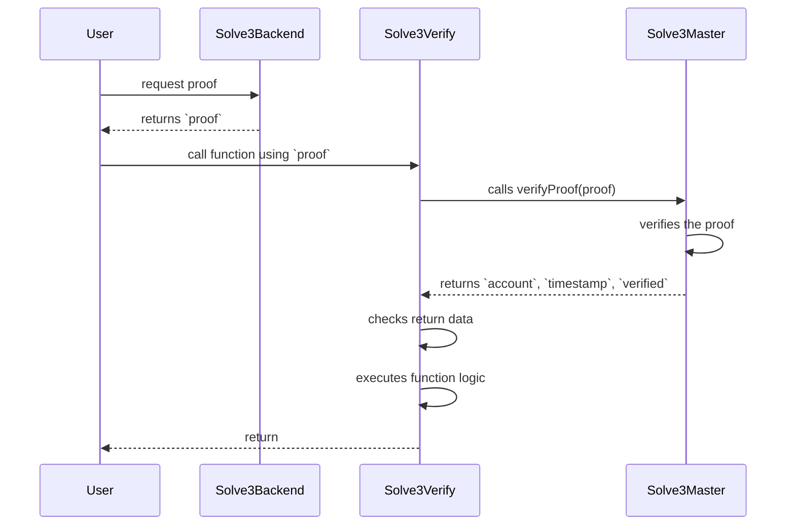

## Introduction

Solve3 addresses the issues caused by bots in various Web3 activities, such as games, NFT sales, and ticket purchases. By implementing captchas and backend proofs, Solve3 ensures a secure and equitable user experience, reducing disruptions caused by bots.

- [Introduction](#introduction)
- [Solve3 Contracts](#solve3-contracts)
  - [Diagram](#diagram)
  - [Solve3Master Contract](#solve3master-contract)
  - [Solve3Verify Contract](#solve3verify-contract)
    - [Implementation Guide](#implementation-guide)

## Solve3 Contracts

Solve3 consists of two essential contracts: `Solve3Master` and `Solve3Verify`. We'll provide an overview of these contracts, their functions, and their deployment addresses.

### Diagram

### Solve3Master Contract

The `Solve3Master` contract is the core of Solve3, managing signer status, nonces, and contract ownership. While developers are not required to implement it, understanding its inner workings can be valuable.

* **Functions**:
    
    * `initialize(address _signer)`: Initializes the contract with a signer address.
    * `getNonce(address _account)`: Retrieves the nonce of an account.
    * `getTimestampAndNonce(address _account)`: Gets the timestamp and nonce of an account.
    * `isSigner(address _account)`: Checks if an account is a signer.
    * `setSigner(address _account, bool _flag)`: Sets the signer status of an account.
    * `transferOwnership(address _newOwner)`: Transfers ownership of the contract.
    * `recoverERC20(address _token)`: Recovers ERC20 tokens.
    * `verifyProof(bytes calldata _proof)`: Verifies a proof and returns account of the proof, timestamp and whether the proof was verified or not.
* **Events**:
    
    * `OwnershipTransferred`: Triggered when contract ownership is transferred.
    * `SignerChanged`: Fired when the signer status of an account changes.

### Solve3Verify Contract

The `Solve3Verify` abstract contract is used to protect your smart contracts with Solve3. You must implement this contract to validate Solve3 proofs. It includes functions to set timestamps and disable Solve3 if needed.

#### Implementation Guide

**Note:** Implementation guide can be found [here](contracts/README.md).

* **Functions**:
    
    * `__init_Solve3Verify(address _solve3Master)`: Initializes the `Solve3Verify` contract with the Solve3 master contract.
    * `disableSolve3(bool _flag)`: Allows you to disable or enable Solve3 as needed.
    * `setValidPeriodSeconds(uint256 _validPeriodSeconds)`: Sets the period in seconds for which a signature is valid.
* **Error Handling**:
    
    * `Solve3VerifyInitializedAlready`: Thrown if trying to initialize the contract when it's already initialized.
    * `Solve3VerifyIsDisabled`: Thrown when a function requires Solve3 to be disabled.
    * `Solve3VerifyIsNotDisabled`: Thrown when a function requires Solve3 not to be disabled.
    * `Solve3VerifyUnableToVerify`: Thrown when a Solve3 proof cannot be verified.
    * `Solve3VerifyAddressMismatch`: Thrown when the account in the proof does not match the sender's account.
    * `Solve3VerifyMsgSignedTooEarly`: Thrown when a message is signed too early.
    * `Solve3VerifySignatureInvalid`: Thrown when a signature is invalid.
* **Events**:
    
    * `Solve3VerifyDisabled`: Fired when Solve3 is disabled.
    * `Solve3ValidFromTimestampSet`: Triggered when the valid-from timestamp is set.
    * `Solve3ValidPeriodSecondsSet`: Triggered when the valid period in seconds is set.